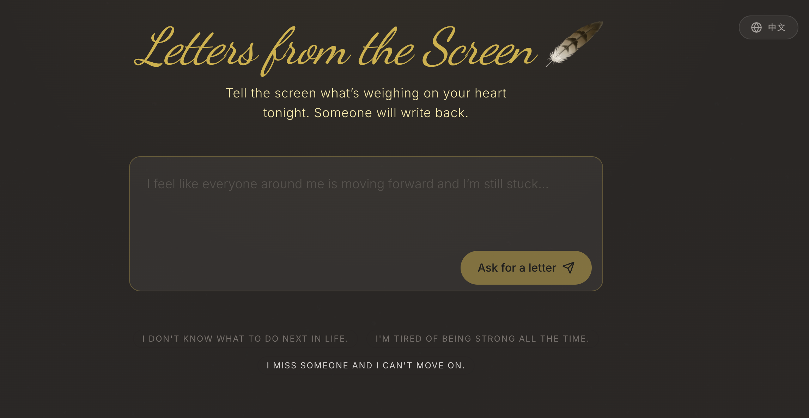
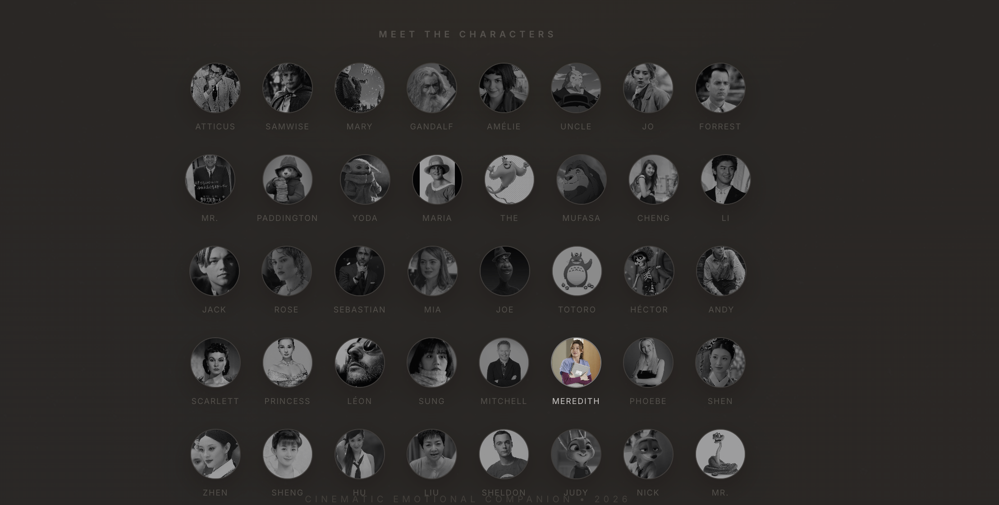
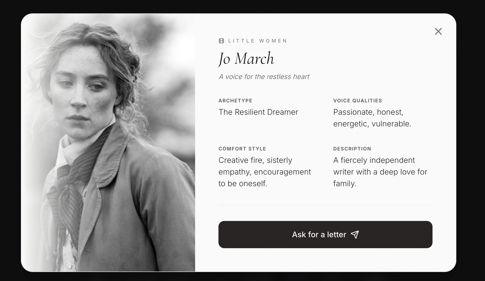
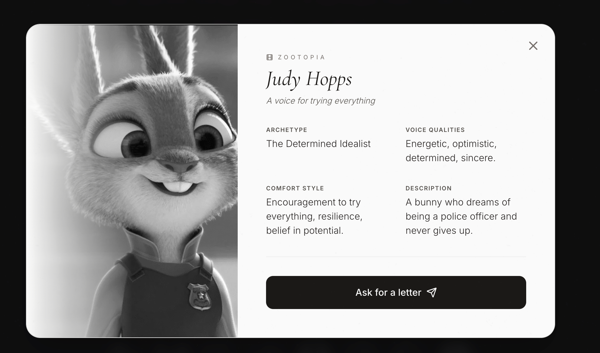
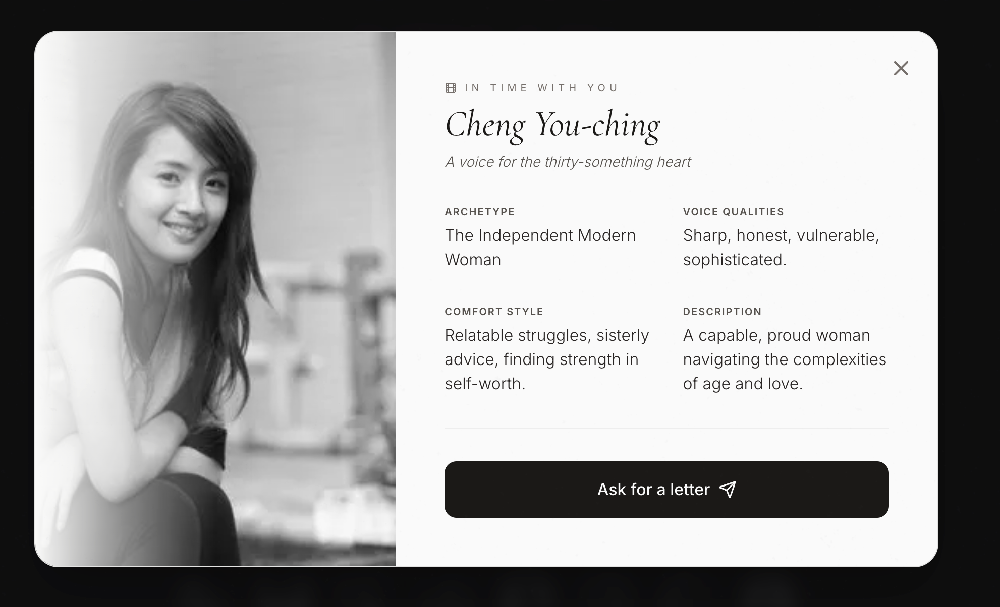
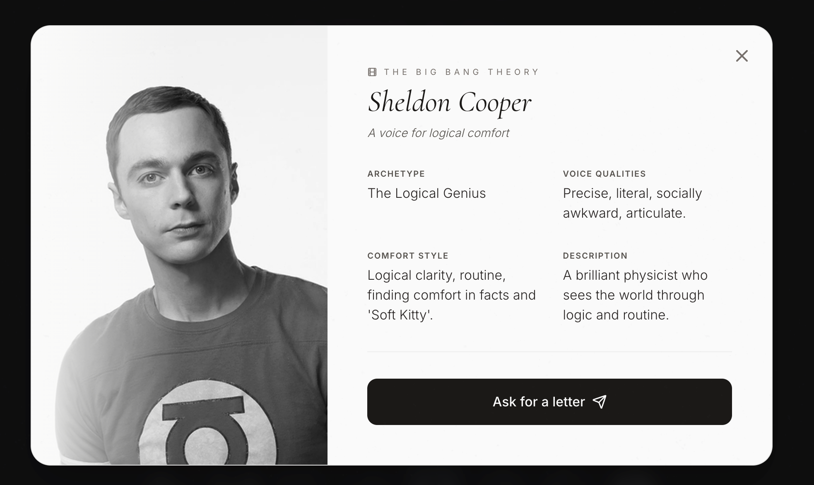
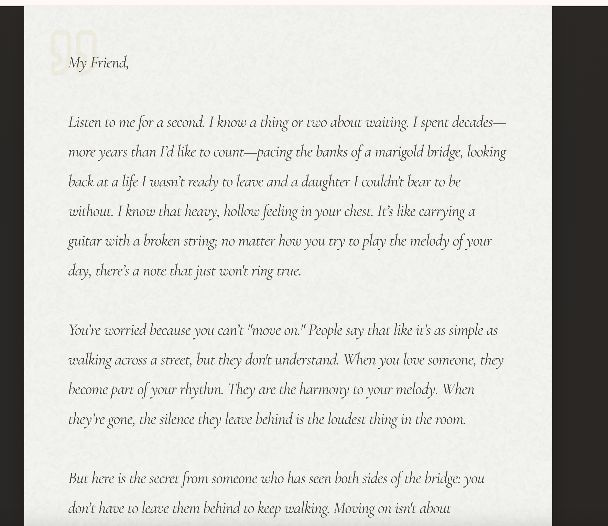
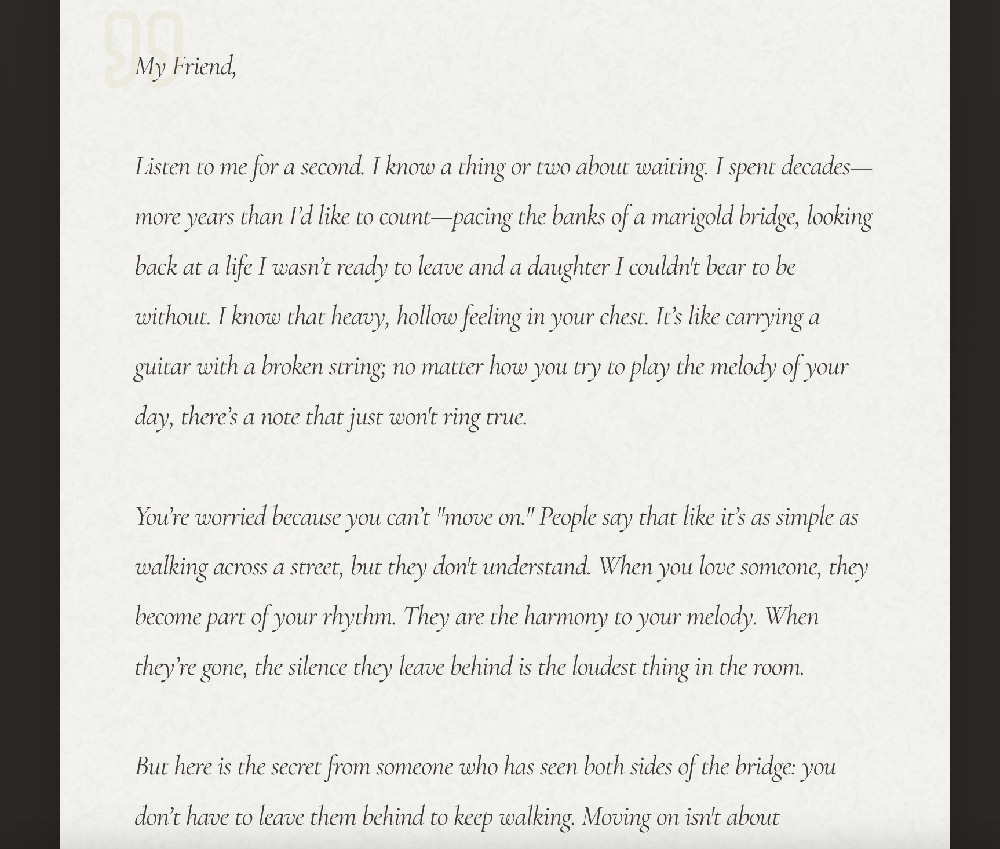
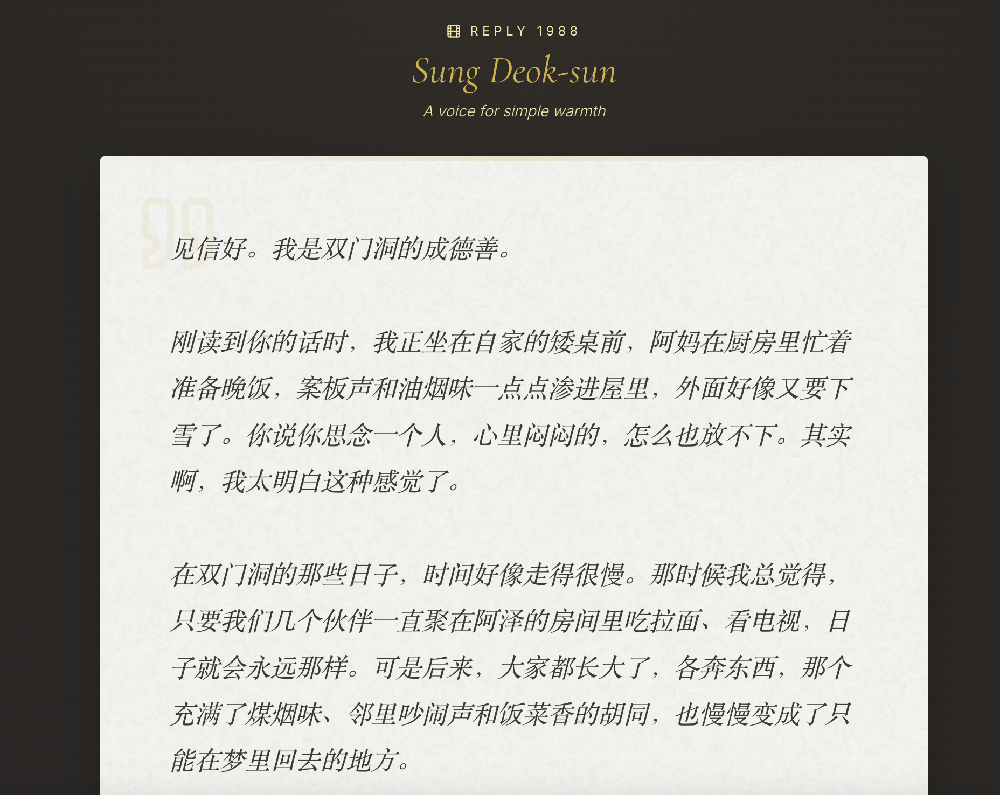
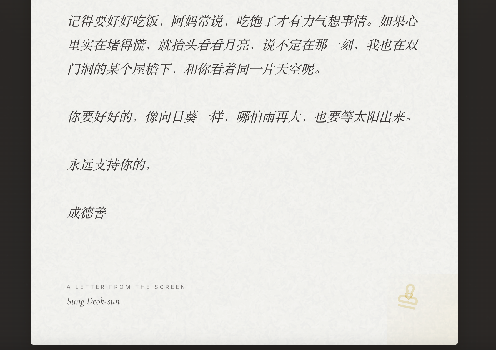

# Letters from the Screen

*A cinematic emotional companion that writes back.*

[Live Demo](https://letters-from-the-screen.vercel.app/) · [GitHub Repository](https://github.com/olivia3395/Letters_from_the_Screen)

**Letters from the Screen** is a poetic web experience where users share what is weighing on their heart, and receive a healing letter from the movie or TV character they need most in that moment.

Rather than feeling like a chatbot, the product is designed as a **fateful letter from the screen** — intimate, literary, atmospheric, and emotionally comforting. Users can either be automatically matched with a fitting character, or explore the character gallery and ask for a letter directly.    

## ✨ Concept

This project began with a simple question:

> What if, instead of generic advice, you could receive a letter from a character whose soul, history, and way of loving the world truly matched your moment?

The result is a web-based emotional companion experience that blends:

- **character-driven comfort**
- **cinematic atmosphere**
- **letter-first interaction**
- **a visually immersive UI**
- **gentle, human-centered emotional support**

It is not therapy, and it does not try to diagnose.  
Instead, it offers something softer: **a beautiful reply when life feels heavy**.

---

## 🌙 Features

- **Free-text emotional input**  
  Users can describe their current struggle, confusion, heartbreak, loneliness, or exhaustion in their own words.

- **Automatic character matching**  
  The system selects a character whose emotional style and worldview best fit the user's situation.

- **Manual character exploration**  
  Users can also browse a curated gallery of comforting characters and choose one directly.

- **Character profile modals**  
  Each character includes:
  - archetype
  - voice qualities
  - comfort style
  - short description
  - emotional positioning

- **Letter-style response experience**  
  Responses are presented as elegant letters rather than plain chat bubbles, with a calm editorial layout and paper-like reading feel.

- **Multilingual / cross-cultural emotional tone**  
  The product supports both English and Chinese emotional expression and aims for warmth across cultural contexts.

## 🖼️ Screenshots

### Character Profile — Jo March

### Character Profile — Judy Hopps

### Character Profile — Cheng You-ching

### Character Profile — Sheldon Cooper

### Letter Experience

### Chinese Letter Experience — Sung Deok-sun

## 🎨 Design Direction

The visual language of **Letters from the Screen** is built around:

- muted gold on deep brown/black backgrounds
- soft cinematic glow
- serif-forward editorial typography
- paper-texture letter layouts
- quiet transitions and intimate spacing
- emotional warmth over productivity aesthetics

The goal was to make the interface feel less like software, and more like:

- opening a letter at midnight,
- standing in front of an old screen,
- or receiving comfort from a fictional soul who somehow knows your heart.

## 🧠 Product Philosophy

This product is guided by a few core principles:

### 1. Letter, not chatbot
The interaction should feel like receiving a meaningful response, not chatting with a generic assistant.

### 2. Character soul over imitation
The writing aims to preserve each character’s worldview, emotional rhythm, and way of comforting others — not just mimic surface-level catchphrases.

### 3. Beauty matters
Emotional products should not only function well, but also feel beautiful, calm, and worth lingering in.

### 4. Soft support, not clinical positioning
This is an experience of companionship and reflection, not a substitute for professional mental health care.

